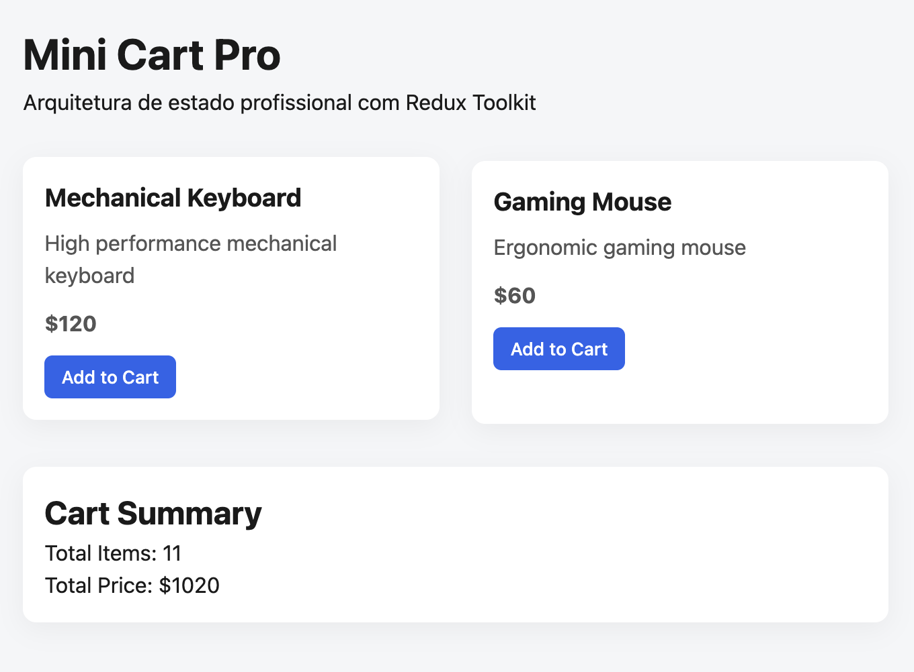

# 🛒 Mini Cart Pro
<p align="center">
    
</p>


---


# 📸 Preview



Mini Cart Pro is a frontend-focused e-commerce simulation built to explore professional state management architecture using **React, TypeScript, and Redux Toolkit**.

The project is designed as a real-world architectural exercise rather than a simple demo. It demonstrates scalable Redux patterns, normalized state management, custom middleware, service layer separation, and a hybrid cart synchronization strategy.

---

## 🚀 Tech Stack

- React
- TypeScript
- Redux Toolkit
- React-Redux
- Vite
- pnpm

---

## 🧠 Architectural Goals

This project focuses on mastering Redux in a production-like scenario.

Key architectural principles:

- Feature-based modular structure
- Normalized state (Record pattern)
- Snapshot strategy for cart pricing
- Custom middleware for persistence
- Service layer abstraction (Redux-agnostic)
- Async flows using `createAsyncThunk`
- Strong TypeScript typing across the store

---

## 🏗 Project Structure

```bash
src/
  app/
    store.ts
    rootReducer.ts

  features/
    cart/
    products/
    auth/

  services/
  middleware/
  hooks/
```

## 🔄 Data Flow Architecture

UI (React Components)
        ↓
dispatch(action)
        ↓
Redux Slice / Thunk
        ↓
Service Layer (Mock API)
        ↓
Promise Resolution
        ↓
Reducer Updates State
        ↓
Middleware Persists Cart
        ↓
Store Updated
        ↓
Selectors Derive Data
        ↓
UI Re-renders

This project follows a clear separation of concerns:
- UI triggers actions
- Thunks orchestrate async logic
- Services simulate backend
- Middleware handles persistence
- Slices remain pure and predictable


### Layers

- **UI Layer** → React components
- **State Layer** → Redux slices and thunks
- **Service Layer** → Backend simulation (mock API)
- **Middleware Layer** → Cross-cutting concerns (persistence)

---

## 📚 Architectural Highlights

### 1. Normalized State Design
Products and cart items are stored using `Record<string, Entity>` patterns for O(1) lookup and scalability.

### 2. Snapshot Pricing Strategy
The cart stores `priceAtAddition` to preserve purchase intent and prepare for future conflict resolution.

### 3. Custom Middleware Persistence
Persistence is handled outside slices to maintain reducer purity.

### 4. Async Flow with createAsyncThunk
Products are fetched using strongly-typed async thunks with error handling and lifecycle states.

### 5. Scalable Folder Structure
The project follows a vertical slice + service layer architecture, ready for SSR migration.

---

## 🛍 Current Features

- Product listing (mock async API)
- Add/remove items from cart
- Quantity updates
- Price snapshot strategy (priceAtAddition)
- Derived state via selectors
- Cart persistence via custom middleware
- Cart hydration via `preloadedState`
- Fully typed Redux store

---

## 💡 Why Price Snapshot?

The cart stores `priceAtAddition` instead of depending directly on the current product price.

This simulates real-world e-commerce behavior:

- Preserves purchase intent
- Avoids UI inconsistency if price changes
- Enables future conflict resolution during checkout

---

## 🔁 Persistence Strategy

- Cart state is automatically saved via custom Redux middleware.
- State is rehydrated on app initialization using `preloadedState`.
- The cart slice remains pure and unaware of persistence.

---

## 📚 Learning Focus

This project is intentionally built step-by-step to explore:

- Redux internals
- Middleware mechanics
- Async flow design
- State normalization
- Scalable architecture decisions
- Hybrid state synchronization strategies

---

## 🧩 Future Improvements

- Cart synchronization with mock backend
- Conflict resolution (merge by quantity)
- Optimistic updates with rollback
- Authentication simulation
- Next.js migration (SSR-ready store setup)

---

## 🛣 Roadmap

- [x] Async product fetching
- [x] Cart slice with snapshot pricing
- [x] Custom persistence middleware
- [ ] Cart sync with backend
- [ ] Conflict resolution (merge by quantity)
- [ ] Authentication simulation
- [ ] Next.js migration

---

## 📦 Installation

```bash
pnpm install
pnpm dev
